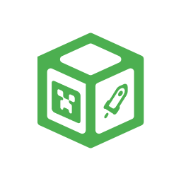

<p align="center">
  
</p>

<h1 align="center">BedrockBoot v2</h1>

<p align="center">
  <b>Industrial Grade Minecraft Bedrock Edition Launcher for Windows & Linux</b>
  <br/>
  <b>一个基于 BedrockLauncher.Core 二次开发的基岩版启动器</b>
</p>
<div align="center">

[](https://github.com/Round-Studio/BedrockBoot/releases)
[](https://github.com/Round-Studio/BedrockBoot/stargazers)
[](https://github.com/Round-Studio/BedrockBoot/releases)
[](LICENSE)

[](https://afdian.com/a/yjq666)
[](https://space.bilibili.com/1527364468)
[-00A4DB?style=flat-square&logo=tencent-qq)](https://qm.qq.com/q/ax057FTyl)
[-00A4DB?style=flat-square&logo=tencent-qq)](https://qm.qq.com/q/1VGh2ai5NS)

</div>

---

# 简介 | Introduction

**BedrockBoot** 是一款为 **Windows** 与 **Linux** 构建的 Minecraft 基岩版高性能启动器。项目旨在帮助用户高效启动 Minecraft Bedrock。  
启动器内集成 **游戏** 与 **CurseForge** 资源下载入口，为用户提供快捷体验  
甚至还有 **PaperConnect** 联机服务，抛弃传统的 Xbox 联机，让联机体验更加舒适  
多目录管理，多实例并存，整合包、资源包、模组统统不在话下  

*\* PaperConnect 联机是与 **BMCBL** 共同开发的一款 Xbox 联机替代方案*

## 特色功能

✅️表示支持，❌️表示不支持

| 功能               | 支持性       | 简述                                                                                                                               |
|--------------------|--------------|------------------------------------------------------------------------------------------------------------------------------------|
| 下载游戏           | ✅️           | GDK，UWP 类型的游戏均支持，全版本均可完整支持                                                                                      |
| 下载资源           | ✅️           | 在 CurseForge 中下载游戏资源，基岩版启动器首创                                                                                     |
| 管理游戏支持包     | ✅️           | 在启动器内管理游戏内资源，包括资源包，行为包，皮肤包 (4D)，存档，世界模版，截图，服务器                                            |
| 资源转换           | ✅️ (Windows) | 可直接在启动器中使用 Java 与基岩版的资源转换。现已支持存档的相互转换，Java 资源包转换至基岩版。甚至还能翻译资源包，行为包          |
| dll 注入           | ✅️ (Windows) | 可在启动器内为游戏实例添加 dll 文件，以实现修改游戏                                                                                |
| 存档管理           | ✅️           | 在启动器内可直接对存档进行备份，设置                                                                                               |
| 鼠标锁             | ✅️ (Windows) | 进行鼠标锁，防止鼠标脱离游戏窗口                                                                                                   |
| 多目录，多实例共存 | ✅️           | 可添加多个游戏目录，并同时运行多个不同的 Minecraft 实例                                                                            |
| 联机               | ✅️           | 内置联机组件，可与 BMCBL 一同联机，可不使用 Xbox                                                                                   |
| 版本隔离           | ✅️ (Windows) | 将每一个不同的游戏实例隔离开，实现游戏资源不互通 (可理解为 Java 版的版本隔离)                                                      |
| 多账户管理，切换   | ✅️ (Linux)   | 在 Linux 平台已支持在启动器内登录 XBOX 账户，并进行线上游戏模式                                                                    |
| 跨平台支持         | ✅️           | 现支持 Windows 与 Linux 平台，Linux 平台使用 ProtonGDK 组件实现 GDK 运行                                                           |
| 兼容其他启动器     | ✅️           | 兼容其他第三方基岩版启动器，例如 BMCBL，LeviLauncher (未完全支持)                                                                  |
| 运行时补全         | ✅️           | 启动游戏前会自动检测当前的启动环境，自动补全缺失的运行组件，保证游戏运行                                                           |
| 启动器插件         | ✅️           | 可在启动器内下载到官方上架的插件，可用于拓展启动器                                                                                 |
| 高度个性化         | ✅️           | 可高度个性化启动器，包括显示字体，背景，背景音乐等等。甚至背景还能 3D 视差。还可以将您当前的个性化设置导出成主题包，分享给您的好友 |
| LeviLamina         | ✅️ (Windows) | 支持在实例中安装，管理，加载 LeviLamina 及其模组                                                                                   |
| 存档地图编辑与预览 | ❌️           | 在启动器内预览与编辑存档，在未来会支持（在做了.jpg）                                                                               |

## 相关链接

* **官网**：[BedrockBoot 官方网站](https://roundstudio.top/bedrockboot)
* **文档**：[BedrockBoot 帮助文档](https://docs.roundstudio.top/docs/product/bb)
* **隐私策略**：[BedrockBoot 隐私策略](https://docs.roundstudio.top/docs/product/bb/privacyPolicy)

# 下载 | Download

你可以从以下官方渠道获取 BedrockBoot 的编译产物：

| 渠道 | 链接 |
| --- | --- |
| **官方下载门户** | [Round Studio Download](https://roundstudio.top/bedrockboot) |
| **GitHub Releases** | [GitHub Release Assets](https://github.com/Round-Studio/BedrockBoot/releases) |

# 快速开始 | Quick Start

## Windows

1. **环境准备**：确保宿主环境为 Windows 10 (19041+) 或 Windows 11。
2. **初始化部署**：下载发行包至非系统保护目录，运行 `BedrockBoot.exe`。
3. **版本调度**：进入"下载"模块，下载所需的基岩版版本或资源包。
4. **启动执行**：配置实例参数后，点击启动即可进入游戏。

## Linux

### 安装

#### Arch Linux ([AUR](https://aur.archlinux.org/packages/bedrockboot))

```
paru -S bedrockboot
```

#### 其他 Linux 发行版

下载发行包，运行 `BedrockBoot.AppImage`。

1. **下载依赖**：初次进入启动器时，需要下载 `ProtonGDK` 游戏运行依赖。
2. **版本调度**：进入“下载”模块，下载所需的基岩版版本或资源包。
3. **启动执行**：配置实例参数后，点击启动即可进入游戏。

# 参与贡献 | Contribution

BedrockBoot 是一个开源且社区驱动的项目，欢迎任何形式的贡献：

* **反馈**：通过 [GitHub Issues](https://github.com/Round-Studio/BedrockBoot/issues) 提交缺陷报告或功能建议。
* **贡献**：Fork 本仓库并提交 Pull Request。请在提交前确保代码通过基础单元测试。
* **技术栈**：C# / C++ / .NET / [Avalonia](https://github.com/avaloniaui/avalonia)。

# 构建项目 | Build From Source

如果您希望自行编译或调试项目：

1. 安装 [Visual Studio 2022](https://visualstudio.microsoft.com/) 或 [Rider](https://www.jetbrains.com/rider/) 并确保以安装 `.NET 桌面开发` 负载。
2. 确保已安装 **.NET 10.0 SDK**。
3. 克隆并编译：
   ```bash
   git clone --recursive https://github.com/Round-Studio/BedrockBoot.git -b 2.0-develop
   cd ./BedrockBoot
   dotnet build -c Release
   ```

# 团队与致谢 | Team & Credits

## 核心开发者
- **Lead Developers**: Dime, YoumiHa
- **UI/UX Design**: Dime, DrMing
- **Core Architecture**: YoumiHa

# 开源协议 | License

该程序基于 **GPLv3** 开源协议发布，并包含以下附加条款：
1. **标识修改**：分发修改版本时，必须以合理方式修改程序名称或版本号。
2. **版权声明**：不得移除或遮盖程序内置的版权声明信息。

---
<p align="right"><i>Refined by Round Studio Architecture</i></p>
